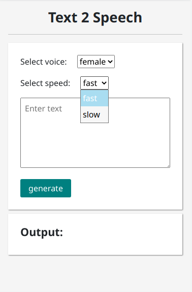
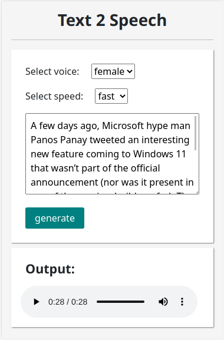

# Text-2-speech

A web based application using python and flask to convert text into speech.

## How to run

- Clone the project in your local directory.
- Now run the following command. (make sure you have [python](https://python.org) 3.X pre-installed in your machine)
```sh
    python run.py
```
- Go the following port in your browser.
```sh
    http://127.0.0.1:5000/
```

## Screenshots
| | |
|-|-|
|before|after|
|||


## Contribution

- Fork this mini-project in your account.
- Make some changes.
- Commit and make a pull request.

Any contribution in this mini-project are always welcome.
